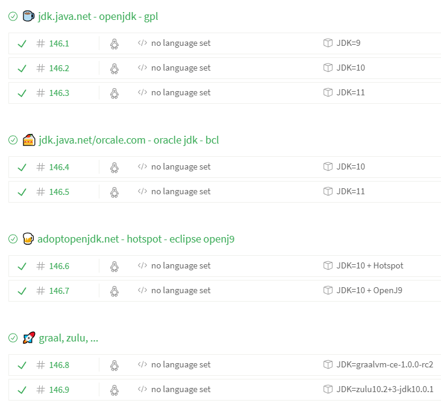

# JDK Matrix on Travis CI

The raw [`bach/install-jdk.sh`](https://github.com/sormuras/bach#install-jdksh) script
supports loading and extracting arbitrary JDK distributions via its `--url <path to .tar.gz file>`
option. The following configuration shows how install JDK builds provided by:

- AdoptOpenJDK from [https://adoptopenjdk.net] including **Eclipse OpenJ9**
- Graal VM from [https://www.graalvm.org]
- Zulu from [https://www.azul.com/downloads/zulu]

[Build #146](https://travis-ci.org/sormuras/sormuras.github.io/builds/395375242)




## Configuration

`.travis.yml`

```yml
language: java
sudo: false
dist: trusty

before_script:
- unset -v _JAVA_OPTIONS
- wget https://github.com/sormuras/bach/raw/master/install-jdk.sh

jobs:
  include:

  - stage: ☕ jdk.java.net - OpenJDK - GPL
    env: JDK=9
    script: source install-jdk.sh -F 9
  - # stage: ...
    env: JDK=10
    script: source install-jdk.sh -F 10
  - # stage: ...
    env: JDK=11
    script: source install-jdk.sh -F 11

  - stage: 🍰 jdk.java.net/orcale.com - Oracle JDK - BCL
    env: JDK=10
    script: source install-jdk.sh -F 10 -L BCL
  - # stage: ...
    env: JDK=11
    script: source install-jdk.sh -F 11 -L BCL

  - stage: 🍺 adoptopenjdk.net - HotSpot - Eclipse OpenJ9
    env: JDK=10 + Hotspot
    script: source install-jdk.sh --url $(curl --silent https://api.adoptopenjdk.net/openjdk10/nightly/x64_linux/ | grep 'binary_link' | grep -Eo '(http|https)://[^"]+' | head -1)
  - # stage: ...
    env: JDK=10 + OpenJ9
    script: source install-jdk.sh --url $(curl --silent https://api.adoptopenjdk.net/openjdk10-openj9/nightly/x64_linux/ | grep 'binary_link' | grep -Eo '(http|https)://[^"]+' | head -1)

  - stage: 🚀 Graal, Zulu, ...
    env: JDK=graalvm-ce-1.0.0-rc2
    script: source install-jdk.sh --url https://github.com/oracle/graal/releases/download/vm-1.0.0-rc2/graalvm-ce-1.0.0-rc2-linux-amd64.tar.gz
  - # stage: ...
    env: JDK=zulu10.2+3-jdk10.0.1
    script: source install-jdk.sh --url https://cdn.azul.com/zulu/bin/zulu10.2+3-jdk10.0.1-linux_x64.tar.gz

after_script:
- echo JAVA_HOME = ${JAVA_HOME}
- echo PATH = ${PATH}
- ls ${JAVA_HOME}
- java -version
```
